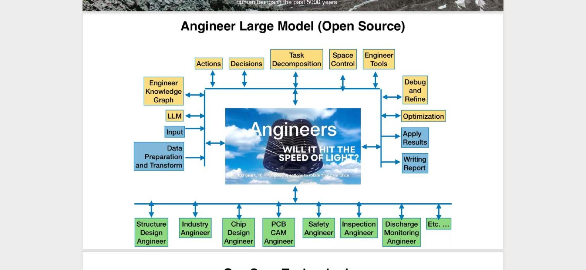

# Angineer Agent Prototype

中文文档 | [English](README_EN.md)



工程领域多智能体原型 —— 按 "Angineer Large Model (Open Source)" 架构图实现，
**完整落地全部 5 种 Agent 设计模式**：

| 模式 | 原型落点 |
|---|---|
| P1 Reflection（自我纠错） | generator-critic 自我批判环 + 周期自检 + 教训沉淀 |
| P2 Plan and Solve（规划求解） | LangGraph Planner → Executor → Replanner 主循环 |
| P3 Tool Use（工具使用） | MCP 风格受控工具层（schema 声明 + 权限包裹 + 留痕） |
| P4 Multi-Agent Collaboration（多智能体协作） | 6 个声明式专业 Angineer + team.ask 代理间协商 |
| P5 Human-in-the-Loop（人在回路） | allow/ask/deny 权限引擎 + 高危拦截 + 验收门禁 |

> **验证状态**（2026-07-20）：离线 Mock 模式 8 项测试全部通过（五模式验证链、
> 交互式权限、关键词兜底、故障注入无死循环）；真实模型模式经 **Kimi k3**
> 在**两个不同任务**（户外储能电源 / 智能电表）上端到端实测通过。
> 详见 `docs/technical-selection_CN.md` 第 1 节与附录（[English](docs/technical-selection_EN.md)）。

## 快速开始

```bash
pip install -r requirements.txt

# `--task` 为必填参数（系统无内置任务，每次运行须明确任务目标）。
# 以下示例统一使用这个任务（与 examples/ 示例数据配套）：
TASK="设计一款智能电表: 完成结构强度校核与 PCB 载流 CAM 检查, 准备数据并做安全审计, 读取放电监测数据, 最后生成工程报告并申请应用变更"

# 离线运行（无需 API Key，结果可复现）
python main.py --task "$TASK" --auto-approve

# 交互模式：ask 权限与验收门禁逐条询问（验证 Human-in-the-Loop）
python main.py --task "$TASK"

# 上传真实数据（半真实模式：工程环境状态来自用户文件，判定逻辑不变）
python main.py --task "$TASK" --upload examples/design_smart_meter.json examples/thermal_monitoring.csv

# 接入真实大模型（任何 OpenAI 兼容端点，含 vLLM/Ollama 开源基座）
export OPENAI_API_KEY=sk-xxx
export OPENAI_BASE_URL=https://api.moonshot.cn/v1   # 按所用平台调整
export ANGINEER_MODEL=你的模型名
python main.py --task "$TASK" --real
```

**Windows cmd 用户**：上面的 `TASK=...` / `$TASK` 是 Linux bash 语法，cmd 不支持。
请用 `set`（等号两边无空格、值不加引号）或直接把任务文本写进命令：

```bat
:: cmd 变量写法（引用时加引号 %TASK%）
set TASK=设计一款智能电表: 完成结构强度校核与 PCB 载流 CAM 检查, 准备数据并做安全审计, 读取放电监测数据, 最后生成工程报告并申请应用变更
python main.py --task "%TASK%" --auto-approve

:: 或者直接内联（推荐）
python main.py --task "设计一款智能电表: 完成结构强度校核与 PCB 载流 CAM 检查, 准备数据并做安全审计, 读取放电监测数据, 最后生成工程报告并申请应用变更" --upload examples/design_smart_meter.json examples/thermal_monitoring.csv --auto-approve
```

### 上传自己的数据（--upload）

默认运行使用内置模拟数据；`--upload` 把环境初始状态换成你的真实数据：

| 文件类型 | 内容 | 示例 |
|---|---|---|
| `.json` 设计状态 | 产品名 / PCB 线宽与要求 / 结构应力 / 放电参数 / 安规裕量 / 检测合格率 | `examples/design_smart_meter.json`（CAM 初检不合格，覆盖完整闭环）、`examples/design_energy_storage_pass.json`（初检即合格，流程自然缩短） |
| `.csv` 监测数据 | 传感器时序数据，真实统计行数/空值/数值范围 | `examples/thermal_monitoring.csv`（200 行，含 8 个空值） |

上传后所有工具的输入数据即来自文件：CAM 按上传线宽判定、安全审计按上传
温升裕量计算剩余空间、data_transform 报告 CSV 真实行数。字段写错会给出
具体报错（未知分节/类型不符/JSON 语法错误），不会静默忽略。

## 一次完整运行的链路（五模式各就各位）

以"户外储能电源设计"任务为例：

1. **P2 规划**：Planner 分解任务为 5 步，分派给 5 个专业 Angineer；
2. **P3 工具**：全部工具调用穿过"schema 校验 → 权限 → 执行 → 日志"受控管线；
3. **P1 反思**：CAM 检查线宽 0.20mm 不合格 → 记录教训；总工结论先经
   自我批判（"缺少结构化汇总与风险分级"）→ 修订后定稿；
4. **P4 协作**：PCB CAM 代理调参前通过 `team.ask` 咨询 Safety 代理
   "线宽加粗对温升的影响"，得到专业答复后才执行优化；
5. **P5 人在回路**：调参/写报告逐条确认，`production.apply` 被 deny
   拦截，流程末尾经**验收门禁**人工确认才结束；
6. 兜底机制：单步最多 8 次迭代、最多 2 次重规划、每步最多 2 轮自我批判
   （Space Control），故障注入验证无死循环。

## 只能跑"户外储能电源"吗？——任务通用性说明

**不是。** 任务相关性分三层：

1. **框架层（任务无关）**：规划-执行-重规划主循环、自我批判环、`team.ask`
   协商、权限引擎、验收门禁对任意任务生效，`--task` 接受任意任务文本；
2. **代理与工具层（领域相关，但声明式可换）**：6 个代理面向工程设计域，
   换领域 = 换 `agents/*.md`（一个 md 文件就是一个代理）和工具 handler，
   主循环代码不用动——这是刻意的架构设计，对应架构图底部总线的 "Etc…"
   扩展位。工具的初始数据既可以是内置模拟值，也可以用 `--upload` 换成
   用户上传的真实数据（见"上传自己的数据"）；
3. **Mock 层（离线规则）**：离线脚本按预设链路运行（关键词路由 + 罐装
   数据），换任务能跑但数据不贴合新任务语义；要"跑得有意义"请用 `--real`
   接真实模型，任何工程类任务都会由模型自主规划执行。

**已实测验证**（2026-07-20，任务"设计一款智能电表"）：Mock 模式自动匹配出
芯片仿真 → CAM 检查 → 检测记录 → 总工的新代理组合；k3 真实模型自主分解出
5 个步骤（含任务文本未明说、模型自行补充的安规审计步），全部通过并生成
变更申请单 CR-2024-SM-001。详见 `docs/technical-selection_CN.md` 附录第四轮（[English](docs/technical-selection_EN.md)）。

## 原始架构图模块 → 代码映射

| 架构图模块 | 代码位置 | 设计模式 |
|---|---|---|
| Task Decomposition | `angineer/graph.py` planner_node | P2 |
| Actions / 底部专业 Angineer 总线 | `angineer/graph.py` executor_node + `agents/*.md` | P2 + P4 |
| Decisions | replanner 条件边（推进 / 重规划 / 结束） | P2 |
| Space Control | `MAX_STEP_ITERS=8` / `MAX_REPLANS=2` / `MAX_CRITIQUES=2` | 防失控 |
| Engineer Tools | `angineer/tools.py` 受控调用层 | P3 |
| Engineer Knowledge Graph | `kg_query` 工具（只读） | P3 |
| Data Preparation and Transform | `data_transform` 工具 | P3 |
| Optimization | `optimization.set_param` 工具（ask 权限） | P3 + P5 |
| Debug and Refine | `reflection.py` + generator-critic 环 + replanner_node | P1 |
| （代理间协作，隐含于总线） | `team.ask` 元工具 + `graph.py` `_consult()` | P4 |
| Writing Report / Apply Results | `report.write` / `production.apply`（deny） | P3 + P5 |
| （验收，贯穿流程） | 权限引擎 + 验收门禁 `final_acceptance` | P5 |
| LLM | `angineer/llm.py`（Mock / OpenAI 兼容可互换） | — |

> **底部绿色总线对照**：Structure Design / Chip Design / PCB CAM / Safety /
> Discharge Monitoring 均有独立代理文件；**Inspection Angineer** 的职责落在
> `inspection.query` 工具上（由 Discharge Monitoring 代理持有调用）；
> **Industry Angineer 与 "Etc…"** 暂未实现——往 `agents/` 目录加一个 md 文件
> 即完成扩展，无需改动主循环代码。

## 目录结构

```
angineer_agent_prototype/
├── main.py                  # CLI 入口（--auto-approve / --real / --task）
├── agents/                  # opencode 风格：一个 md 文件 = 一个专业 Angineer
│   ├── structure_design.md  #   YAML frontmatter 声明：名称/描述/授权工具/权限覆盖
│   ├── chip_design.md       #   全部代理均配 team.ask（代理间协商）
│   ├── pcb_cam.md
│   ├── safety.md
│   ├── discharge_monitoring.md
│   └── chief.md             # 总工程师：汇总、写报告、发起变更申请
├── angineer/
│   ├── graph.py             # LangGraph 主图(P2) + 批判环(P1) + _consult(P4) + 验收门禁(P5)
│   ├── tools.py             # MCP 风格工具注册表 + 受控调用层（P3 核心）
│   ├── permissions.py       # allow/ask/deny 权限引擎，通配符后匹配优先（P5）
│   ├── reflection.py        # 周期自检 + 教训沉淀（P1 执行期自省）
│   ├── upload.py            # --upload 数据接入：设计 JSON / 监测 CSV → EngineeringWorld
│   ├── agents_loader.py     # 声明式代理加载器
│   └── llm.py               # LLM 抽象：decompose / act / critique 三接口
├── examples/                # --upload 示例数据（2 个设计 JSON + 1 个监测 CSV）
└── docs/technical-selection_CN.md      # 五模式设计逻辑、选型论证、验证证据、工程化路线
```

## 运行产物

| 文件 | 内容 |
|---|---|
| `output/engineering_report.md` | 自动汇总各专业执行结果与教训记录 |
| `output/tool_calls.jsonl` | 全部工具调用留痕（工具名/参数/状态/时间戳） |

## 参考的开源项目（按模式）

- **P1**：Reflexion（NeurIPS'23）· Self-Refine（NeurIPS'23）· CRITIC（ICLR'24）· LangGraph Reflection 教程
- **P2**：Plan-and-Solve-Prompting（ACL'23）· LangGraph Plan-and-Execute · LLMCompiler（ICML'24）
- **P3**：MCP servers · ToolBench（ICLR'24）· gorilla/BFCL
- **P4**：CrewAI · Microsoft AutoGen → Agent Framework · MetaGPT
- **P5**：LangGraph interrupt/HITL · CopilotKit · AG-UI 协议 · sst/opencode（权限模型）
- 产品级参考：hermes-agent（反思内核）· OpenClaw（定时调度，路线图）

选择原因与对比论证见 `docs/technical-selection_CN.md`。
